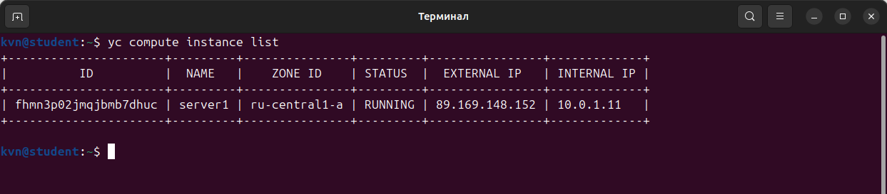
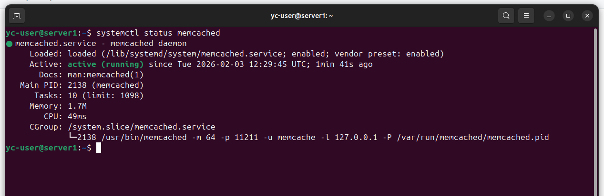
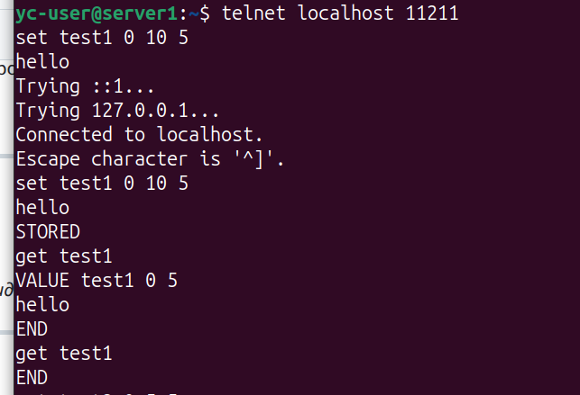
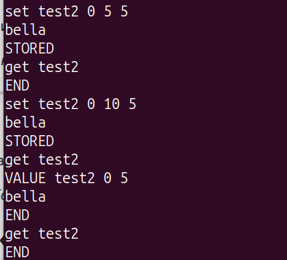
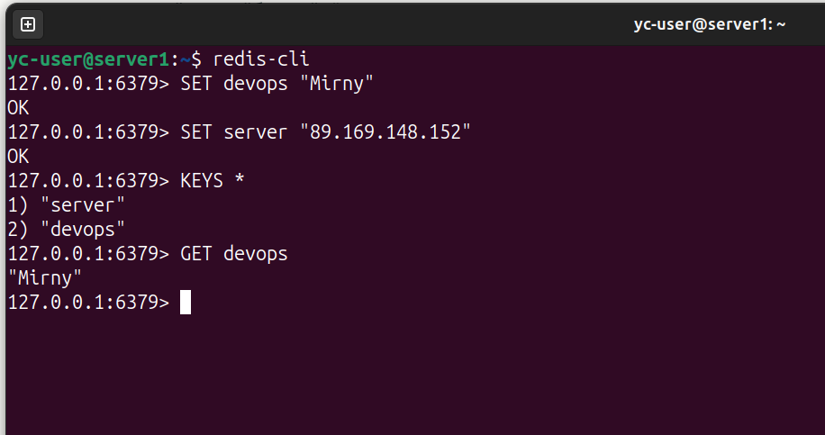
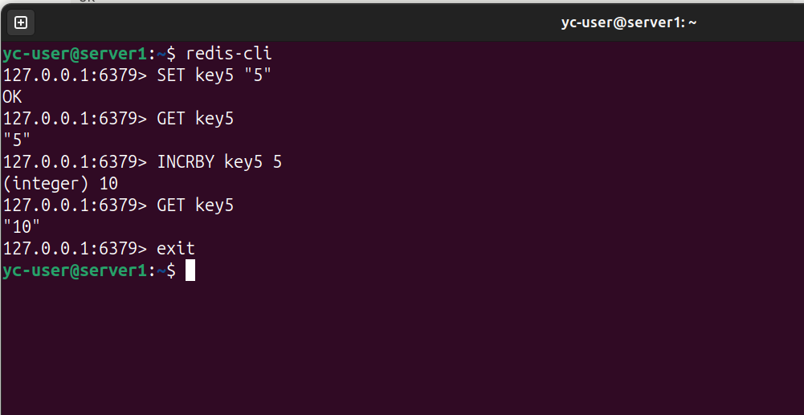

# Домашнее задание к занятию "Кеширование Redis/memcached" - Кучин Виталий

### Инструкция по выполнению домашнего задания

   1. Сделайте `fork` данного репозитория к себе в Github и переименуйте его по названию или номеру занятия, например, https://github.com/имя-вашего-репозитория/git-hw или  https://github.com/имя-вашего-репозитория/7-1-ansible-hw).
   2. Выполните клонирование данного репозитория к себе на ПК с помощью команды `git clone`.
   3. Выполните домашнее задание и заполните у себя локально этот файл README.md:
      - впишите вверху название занятия и вашу фамилию и имя
      - в каждом задании добавьте решение в требуемом виде (текст/код/скриншоты/ссылка)
      - для корректного добавления скриншотов воспользуйтесь [инструкцией "Как вставить скриншот в шаблон с решением](https://github.com/netology-code/sys-pattern-homework/blob/main/screen-instruction.md)
      - при оформлении используйте возможности языка разметки md (коротко об этом можно посмотреть в [инструкции  по MarkDown](https://github.com/netology-code/sys-pattern-homework/blob/main/md-instruction.md))
   4. После завершения работы над домашним заданием сделайте коммит (`git commit -m "comment"`) и отправьте его на Github (`git push origin`);
   5. Для проверки домашнего задания преподавателем в личном кабинете прикрепите и отправьте ссылку на решение в виде md-файла в вашем Github.
   6. Любые вопросы по выполнению заданий спрашивайте в чате учебной группы и/или в разделе “Вопросы по заданию” в личном кабинете.
   
Желаем успехов в выполнении домашнего задания!
   
### Дополнительные материалы, которые могут быть полезны для выполнения задания

1. [Руководство по оформлению Markdown файлов](https://gist.github.com/Jekins/2bf2d0638163f1294637#Code)

---

### Задание 1
Решает проблемы высокой нагрузки на источники данных и задержек при их обработке.  
Ускоряет доступ к часто используемым данным, за счёи уменьшения времени отклика приложений.

***Медленный доступ к БД***
Частые запросы к базе данных перегружают её и замедляют работу.  
Кэширование хранит результаты запросов в быстрой памяти, позволяя обслуживать повторные обращения без повторного чтения из БД.  

***Пиковые нагрузки***
Во время всплесков трафика (распродажи, события) серверы не справляются с запросами.  
Кэш снижает нагрузку, выдавая готовые данные тысячам пользователей одновременно.

***Перегрузка БД***
При истечении TTL кэша множество запросов одновременно обращаются к БД, вызывая её перегрузку.  
Решение — прогрев кэша заранее или постоянное хранение критических данных.
​

***Долгие вычисления***
Сложные операции (агрегация данных, ML-инференс) занимают секунды.  
Кэширование сохраняет результаты, сокращая время с секунд до миллисекунд.

### Задание 2

1) В Yandex Cloud развёрнута структура при помощи  terraform. Создана одна витруальная машина.  
2) На эту ВМ при помощи ansible playbook установлен memcahed.  
3) Заходим на сервер ssh yc-user@89.169.148.152. Проверяем работу memcached.    

Ссылка на Ansible playbook1.  

<a href="../playbook1.yml" target="_blank"> Файл playbook1.yml</a> 

Скриншоты.  
  
  

### Задание 3

1) Запускаем терминал и подключаемся к серверу через ssh.  
2) Запускаем сессию telnet localhost 11211.   
3) Записываем ключи в формате "set test1 0 5 5" параметры 0 5 5 — это  формат протокола memcached: FLAGS TTL BYTES.  
4) TTL=5 оказалось мало. Установил 10 сек. На скриншотах видно что сначала значение по запросу get отображается, а затем по истечении TTL исчезает.

Скриншоты.  
  
 

### Задание 4

1) Пишем второй плейбук для установки Redis.
2) Подключаемся через ssh к серверу.
3) Запускаем redis-cli. Записываем ключи через команду SET. Читаем командой GET.

Ссылка на Ansible playbook2.  

<a href="../playbook2.yml" target="_blank"> Файл playbook2.yml</a> 

Скриншоты.  
  
 

### Задание 5*

Скриншоты.  
  
